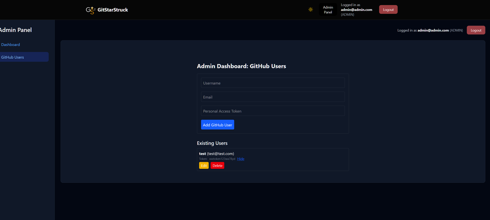

# GitStarStrucks


**GitStarStrucks** is an app that allows users to earn `StarStruck Achievement` for their GitHub profile. Easily boost your GitHub presence with a seamless integration to show off your achievements.

**Stack** : Next, Prisma, SQLite

## Table of Contents

- [Installation](#installation)
- [Setup Instructions](#setup-instructions)
- [Development Commands](#development-commands)
- [Migrations and Seeding](#migrations-and-seeding)
- [Build and Deployment](#build-and-deployment)

## Installation

Follow these steps to install dependencies and set up the project:

1. Install dependencies:

   ```bash
   pnpm install
   ```

2. Approve the builds:

   ```bash
   pnpm approve-builds
   ```
**Then press `a` to select all and  press `y` to accept**

3. Copy the `.env.example` file to `.env` and configure the necessary environment variables:

   - **Windows**:
     - Run `copy .env.example .env` in your terminal or use a file manager to copy and rename the file.
     - Open `.env` and update environment variables as needed (e.g., database URL, API keys).
   - **Unix/macOS**:
     - Run `cp .env.example .env` in your terminal.
     - Open `.env` and modify environment variables accordingly.

4. **To apply pending migrations**:

   ```bash
   pnpx prisma migrate deploy
   ```

5. **To create an admin user** using Prisma seed: (Creates admin user with username `admin@admin.com` and password `admin123`)

   ```bash
   pnpm tsx prisma/seed.ts
   ```

6. To start the development server:

   ```bash
   pnpm dev
   ```

7. To build the project for production:

   ```bash
   pnpm build
   ```

8. To start the production build:
   ```bash
   pnpm start
   ```

9. Login as `admin` and create starrer users that will star the repo : data : {username, email, PAT} (github)





## Development Commands

1. **To create a new migration** during development after changing the schema:
   ```bash
   npx prisma migrate dev --name <name>
   ```


## Production Deployment on bare metal with PM2

We are using sqlite which is not supported at least for free in serverless infra providers like vercel, netlify etc, so we will deploy on bare metal using pm2:

```bash
pm2 start ecosystem.config.js
```

> Considering a matured relational db like postgres is not considered given that we only require limited number of tables and minimal usage of entity relationships in this project, flatfile storage/sqlite best suits it.

## Notes

- Make sure that your `.env` is configured correctly to avoid runtime errors.
- If you make any changes to the Prisma schema, remember to run the migration commands (`migrate dev` and `migrate deploy`) as appropriate.
- During development, you can use `pnpm dev` to run the app locally, and when you're ready to deploy, use `pnpm build` followed by `pnpm start`.

---

Feel free to reach out for any support or contributions. We'd love to hear from you!
